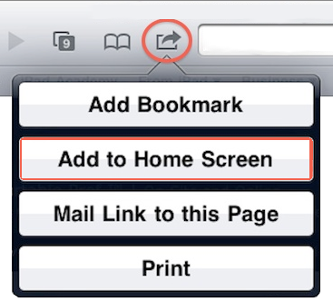

Hz
===

Hz is an app that generates a sine wave and allow you to remotly control its **volume** and its **frequency** through HTTP requests.

The remote control is a Web App made for iPad.


This app is part of an art project for [écal](http://ecal.ch). The purpose of the project was to make a water flow looks freezed in the time.  
You can watch the concept of the project in this video: [Cool Sound and Water Experiment!](http://youtu.be/mODqQvlrgIQ)

Dependencies
------------

To run this program, you will need:

- [Node.js](http://nodejs.org#download)

- [SoX](http://sox.sourceforge.net/)

Installation & Usage
--------------------

1. Start the program with `node app.js` or `app.js`

2. Type the `http://<your-computer-local-ip>:4040/` whatever onto your iPad's browser

3. The left column changes the volume and the right one the frequency

4. You can also add the Web App to your home screen to get it fullscreen



Notes
-----

The volume control only works on Mac OS X for the moment.

The frequency sent by the Web App varies between **20Hz** and **30Hz**, but this can be changed in the client app.

API
---

If you want to develop another web app, here is HTTP requests you can send to the server:

Change the volume:

```
http://<your-computer-local-ip>:4040/controls/volume/<volume>
```

Change the frequency:

```
http://<your-computer-local-ip>:4040/controls/freq/<frequency>
```


